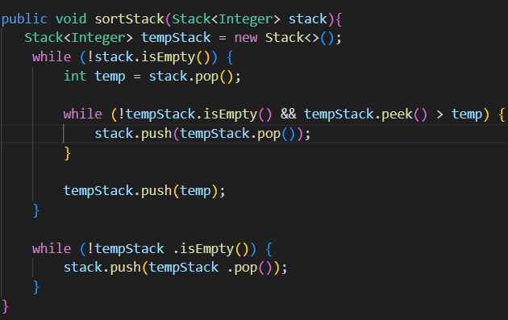

## Practica: Estructura Lineales - Ejercicios

**Estudiante:**  [Michelle Marca]

**Docente:** Ing. Pablo Torres
**Fecha:** 10/06/2025
**Version:** 2.0.2 

## Descripcion General:
En este proyecto realizamos 3 ejercicios usando Pilas y Colas. El proyecto esta organizado en paquetes app y utils. Se ejecuta desde la clase App.

## Estructura del Proyecto

## Ejercicio 01: Validación de Signos

Determina si una cadena que contiene los caracteres `( ) { } [ ]` es válida.
Usa un **Stack** para verificar que cada símbolo de apertura tenga su cierre correcto y en el orden adecuado.

**Reglas:**
- Todo símbolo de apertura debe cerrarse.
- Los símbolos deben cerrarse en el orden correcto.
- Cada cierre debe corresponder al tipo de apertura correcto.

**Código:**

**Salida de consola:**

## Ejercicio 02: Ordenar un Stack

Ordena un Stack de enteros de forma que el menor elemento quede en el tope.
Solo se usan Stacks adicionales y operaciones propias: `push`, `pop`, `peek`, `isEmpty`.

**Código:**

**Salida de consola:**

## Ejercicio 03: Palíndromo usando Colas

Determina si una palabra es palíndromo usando una **Queue** y un **Stack**.
Se aprovecha el comportamiento FIFO de la cola y LIFO de la pila para comparar caracteres sin invertir el String directamente.

**Código:**

**Salida de consola:**

**Url**
https://github.com/marcamichelle1209-arch/icc-est-u2-EstructurasLineales-Pilas-y-Colas/releases/tag/v2.0.2